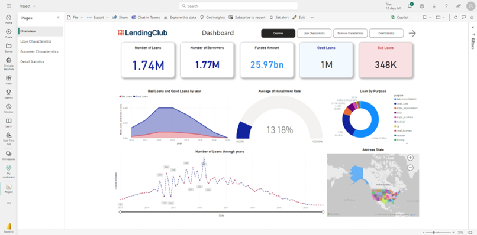

<div align="center">
  <a href="#">
    
  </a>

  <div id="user-content-toc">
    <ul>
      <summary><h1 style="display: inline-block;">💸 P2P Loan Performance Analysis 📊</h1></summary>
    </ul>
  </div>
  
  <p>Azure Cloud Pipeline with Data Factory, Blob Storage, Spark, Databricks, SQL Database and PowerBI</p>
</div>
<br>

## 📝 Table of Contents
1. [Introduction](#introduction)
2. [Project Overview](#project-overview)
   - [Dataset](#dataset)
   - [Project Goals](#project-goals)
   - [Technologies](#technologies)
3. [Key Insights](#key-insights)
4. [Project Architecture](#project-architecture)
   - [Data Ingestion](#data-ingestion)
   - [Data Transformation & Loading](#data-transformation--loading)
   - [Data Reporting](#data-reporting)
5. [Project Structure](#project-structure)
6. [Usage - Demonstration](#usage---demonstration)
7. [Contributing](#contributing)
8. [Acknowledgments](#acknowledgments)

<a name="introduction"></a>
## 🔎 Introduction

Lending Club is one of the largest peer-to-peer (P2P) lending platforms in the United States, established in 2007. It connects borrowers directly with individual or institutional investors, facilitating a flexible and convenient online lending system. The platform operates by allowing borrowers to register, provide personal and financial information, and undergo a credit risk assessment. Once approved, loans are offered to investors, who can choose to fund all or part of the loan, creating diverse investment opportunities. Lending Club manages the loan repayment process and implements risk management strategies to ensure transparency and compliance with financial regulations.

The company requires robust data management to monitor lending activities, evaluate loan performance, and analyze trends. The goal of this project is to process, store, and visualize data to provide actionable insights that enhance decision-making and improve operational efficiency, ultimately fostering a stable and sustainable business environment.

<a name="project-overview"></a>
## 📊 Project Overview

This project aims to build an end-to-end data pipeline that processes, stores, and visualizes by leveraging the power of data from the Lending Club platform and Azure Cloud services. The data includes information such as loan amount, interest rate, loan duration, and loan status. The project will use Azure Data Factory (ADF) to ingest the data, transform it using Databricks & Spark, load it into Azure SQL Database, and generate interactive & insightful dashboards using PowerBI.

<a name="dataset"></a>
### 💾 Dataset

- **Data Type**: Loan data from the largest P2P lending platform (Lending Club) spanning from 2007 to Q3 2020.
- **Size**: Approximately 1.73 GB, containing 2.9 million rows and 141 columns.
- **Format**: CSV (Comma-Separated Values).
- **Source**: The dataset is sourced from Kaggle and can be accessed at [Kaggle Lending Club Dataset](https://www.kaggle.com/datasets/ethon0426/lending-club-20072020q1).
    > **Preview (500 records)**: [Lending Club Dataset Preview](./dataset/Loan_status_2007-2020Q3_sample_500.xlsx)

<a name="project-goals"></a>
### 🎯 Project Goals
- Analyze loan performance using the Lending Club platform data.
- Ingest, transform, and load the data into Azure SQL Database using Azure Data Factory (ADF).
- Apply data cleaning and transformation using Azure Databricks with Spark.
- Create interactive data visualizations and reports with Microsoft Power BI.

<a name="technologies"></a>
### ⚙️ Technologies
- **Data sources**: Azure Blob Storage
- **Data pipeline**: Azure Data Factory
- **Data storage**: Azure SQL Database
- **Data visualization**: PowerBI Service
- **Data processing**: Azure Databricks
- **Data transformation**: Spark, Python, SQL, Jupyter Notebook

<a name="key-insights"></a>
## 📈 Key Insights
- 💸 **Overall Revenue & Loan Performances**
  - Number of loans and borrowers: **1.74 million loans** and **1.77 million borrowers** with about **1 million** Good loans & **~350k** bad loans. with total funed loans of **~25.97 billion.**
  - **~57,38%** of the loans being used for debt consolidation and **~22,48%** for credit card purposes.
  - Average Installment rates: **13,18%**
 
- 🪙 **Loan Characteristics**
  - The rate of people who default on their loans is **~19.71%** which is higher than the national average of **~15.5%**.
  - With good loans, ROI is **13,67%** but with bad loans it is **~-37.89%**. Another bad sign is that IRR is **1,35%** which is indicate that the loans is not performing well.
  - People mostly refer to use term loans of 36 months (**74.74%** number of loans).
  - The average loan amount is 14,700 USD.

- 🚻 **Borrower Characteristics**
  - People with **good FICO scores are more likely to Fully paid off their loans** (ratio of people who fully paid/people who defaulted is correllated to FICO score).
  - **~68,79%** of borrowers are verified their Income soucres are legitimate.
  - Most of people have **stable annual income likely to be fully paid off their loans.**

- 🔢 Details statistics
    - Futher details statistics can be found in the [PowerBI-snapshot](./dashboard-snapshot.pdf) file.

<a name="project-architecture"></a>
## 🚀 Project Architecture
You can find the detailed information on the diagram below:


<a name="data-ingestion"></a>
### 🧱 Data Ingestion

The data will be ingested into Azure Data Factory (ADF) using the Azure Data Factory Copy Activity. The Copy Activity will read data from the on-premise file system and write it to an Azure Blob Storage container. The data will be ingested into a staging table for further analysis.

<p align="center">
  
</p>

<a name="data-transformation--loading"></a>
### 🛠️ Data Transformation & Loading

The data will be transformed using Azure Databricks (ADB) using the Azure Databricks, read data from the Blob Storage container and write it to an Azure SQL Database. Performing the two stages of data transformation with Azure Databrick & Azure Mapping Data Flow for loading will help to reduce the time taken to load the data into the SQL Database.

<p align="center">
  
  
</p>

Using Azure Mapping Data Flow for loading the data into Azure SQL Database follow the Star Schema mapping.

<p align="center">
  
  
  
</p>

<a name="data-reporting"></a>
### 📊 Data Reporting
The data will be visualized using PowerBI. The PowerBI report will include visualizations such as bar charts, line charts and other charts to analyze loan performance. We provide the following features in the PowerBI report:
  - Deployed PowerBI report from Desktop to PowerBI Service, support for sharing and collaboration.
  - Implemented near real-time data model pipeline on PowerBI Service leveraging Azure Cloud services.
  - Implemented row-level security to secure the data while sharing the report.
  - Building Responsive dashboards with PowerBI for both desktop and mobile devices, providing a seamless user experience.
  - The report will also include drill-down, navigation, and filtering capabilities to allow users to explore the data in more detail.

<p align="center" width="100%">
  
  
  
  
</p>

<a name="project-structure"></a>
## 🛜 Project structure

```
├── dataset
│   ├── Loan_status_2007-2020Q3_sample_500.xlsx
├── src
│   ├── adf_pipeline_template.zip // used for creating the ADF pipeline template
│   ├── Databrick_processing.ipynb // Spark notebook for data transformation
│   ├── Visualization.pbix // PowerBI report for Desktop version
│   ├── warehouse.sql // SQL script for creating the warehouse
├── README.md
├── pitching.pptx // pitching deck
├── dashboard-snapshot.pdf // PowerBI report snapshot
├── Report.pdf // Detailed documentation
```

<a name="usage---demonstration"></a>
## 📽️ Usage - Demostration
To run the project, follow these demo video resources for futher usage & understanding:

1. [Building ETL Pipeline on Azure](https://www.youtube.com/watch?v=WkxOgtoh7wk)
2. [ETL Pipeline optimization](https://www.youtube.com/watch?v=WH2hiA0Mhr4)
3. [Data visualization with PowerBI](https://www.youtube.com/watch?v=zJjLjgF72JU)

<a name="contributing"></a>
## Contributing
Contributions to this project are welcome. If you find any issues or have suggestions for improvements, please open an issue or submit a pull request.

<a name="acknowledgments"></a>
## Acknowledgments
We would like to thank our instructor and the University of Information Technology for providing the resources and support for this class project.